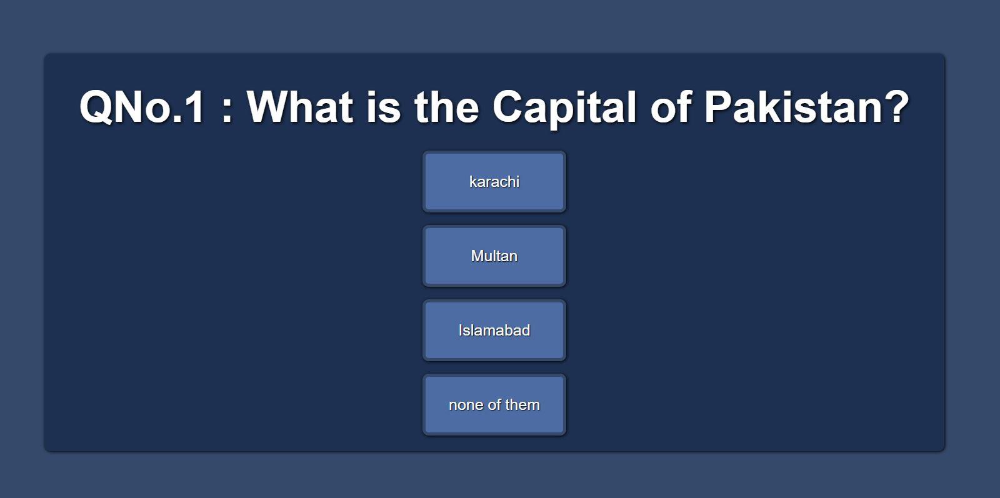

# Quiz Game - JavaScript base Game

Quiz Game is a JavaScript base Game that allows user to have multiple quizes and become a source of user engagement and attraction.

## Multiple Questions in Quiz Game

There are multiple questions in Quiz Game that gives user four possible answer out of which the correct one is to be selected by user and a user gains one point.

## Calculating Score in Quiz Game

At the end of the Game, the score is displayed depending upon the number of right answers.

